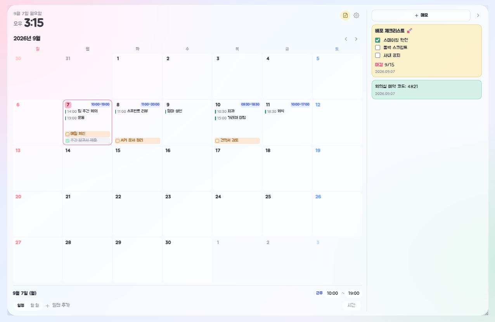

# 캘린더 위젯

Windows 바탕화면에 반투명하게 띄우는 업무용 월간 플래너.

날짜 칸 하나에 **유연근무 시간 · 일정 · 할 일** 세 가지가 같이 보이고,
오른쪽에는 접었다 펼 수 있는 **마크다운 메모장**이 붙는다.

- 다른 창들 뒤에 깔려 바탕화면처럼 있다가, 창을 내리면 나타난다
- 배경화면 밝기를 읽어 밝은/어두운 테마를 스스로 바꾼다
- 유연근무제를 쓰면 날마다 다른 출퇴근 시간을 칸 위에 고정해 볼 수 있다
- 데이터는 PC 안 JSON 파일 하나. 어디로도 보내지 않는다

## 설치

[Releases](../../releases) 에서 받는다.

| 파일 | 설명 |
|---|---|
| `캘린더 위젯 Setup x.y.z.exe` | 설치본. 시작 메뉴·바로가기·제거 프로그램이 생긴다 |
| `캘린더위젯-portable-x.y.z.exe` | 무설치본. 실행하면 바로 뜬다 |

> **코드 서명이 없어서** 처음 실행하면 "Windows의 PC 보호" 경고가 뜬다.

프레임리스 창이라 닫기 버튼이 없다. **끄려면 작업표시줄 트레이의 분홍 달력 아이콘을 우클릭**한다.

## 조작

| | |
|---|---|
| 날짜 칸 클릭 | 그 날짜 선택 (아래 편집줄이 따라온다) |
| 할 일 한 번 클릭 | 완료 토글 |
| 항목 두 번 클릭 | 수정 모드 켜기/끄기 |
| 항목 끌어다 놓기 | 다른 날짜로 이동 |
| 창 모서리 끌기 | 크기 조절 (칸에 보이는 항목 수가 따라 늘고 준다) |
| 메모장 왼쪽 경계 끌기 | 메모장 폭 조절 |
| 메모 안에서 `Win` + `.` | 이모지 입력 |

## 라이선스

MIT. 자세한 건 [LICENSE](LICENSE).

글꼴로 **Jua(배달의민족 주아체, OFL-1.1)** 를 포함한다.
그 밖에 포함된 오픈소스는 [THIRD-PARTY-NOTICES.md](THIRD-PARTY-NOTICES.md) 참고.

---

## 개발

빌드 방법과 구조는 [docs/DEVELOPMENT.md](docs/DEVELOPMENT.md) 참고.
